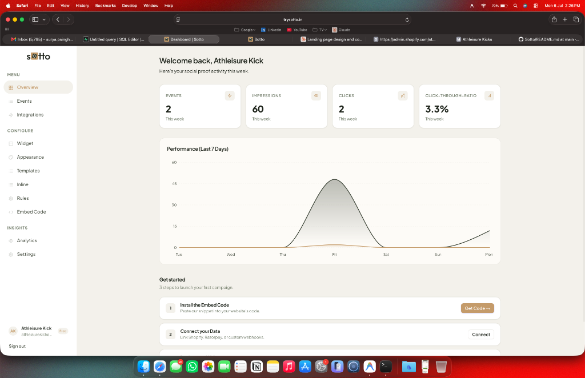
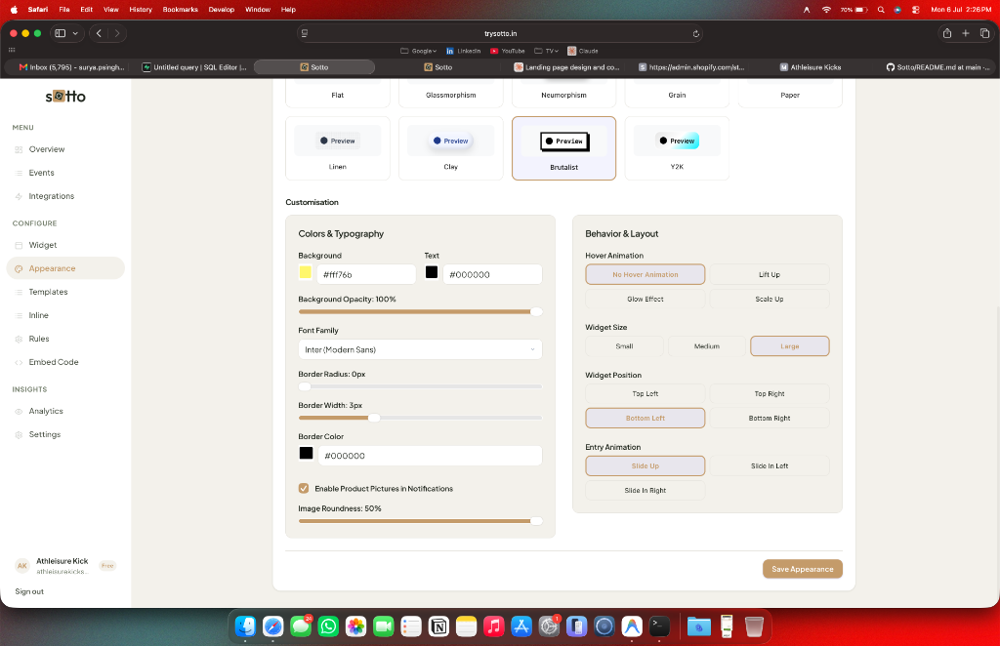
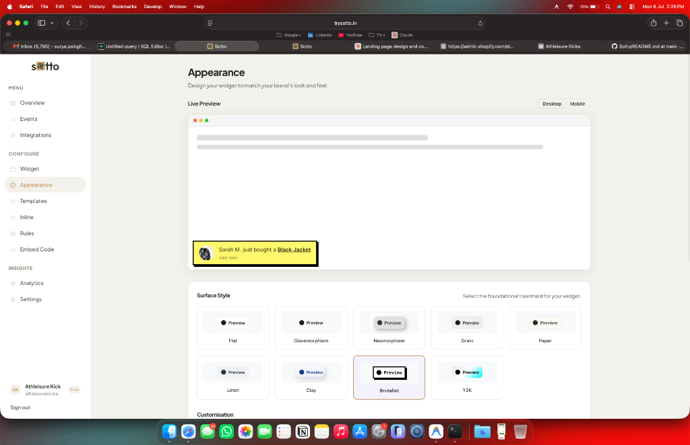

<div align="center">
  <h3>Sotto - Social Proof & Marketing Infrastructure</h3>
  <p>A high-performance SaaS integrating with 20+ e-commerce platforms to inject real-time social proof directly into client storefronts.</p>

  <div>
    <a href="https://www.trysotto.in">Live Demo</a>
    <span>&nbsp;·&nbsp;</span>
    <a href="#features">Features</a>
    <span>&nbsp;·&nbsp;</span>
    <a href="#architecture-and-engineering">Architecture</a>
  </div>
</div>

---

## Overview

Sotto is a production-ready marketing widget designed to help e-commerce stores increase their conversion rates by displaying real-time purchase data and simulated active visitor counts. 

It was built on the core assumption that as AI continues to lower the barrier to entry for software and product creation, the number of independent online businesses will rise exponentially. In a highly saturated market, establishing trust through highly customized, brand-conscious social proof will become the primary differentiator for emerging storefronts.

Sotto consists of two main components:
1. **The Merchant Dashboard**: A Next.js (App Router) web application where store owners configure their widget's appearance, set advanced behavioral rules, and connect to over 20 supported e-commerce platforms (Shopify, Stripe, WooCommerce, etc.).
2. **The Injectable Widget**: A lightweight, highly-optimized vanilla JavaScript widget (`widget.min.js`) that clients embed directly into their storefront HTML.

## Showcase

*Note to recruiters and reviewers: Screenshots and demonstrations of the dashboard configuration and live widget are included below.*

### Dashboard Experience




### Storefront Integration
[Placeholder: Link to desktop storefront GIF]
[Placeholder: Link to mobile storefront GIF]

## Features

Sotto goes beyond standard popup notifications by offering deep visual customization and advanced behavioral targeting, ensuring the widget feels like a native extension of the client's brand rather than an obtrusive third-party add-on.

### Deep Customizability & Brand Consciousness
Merchants can finely tune every visual aspect of their widgets. From exact hex colors and custom typography to border radius, dynamic sheen animations, and stylized brutalist drop shadows, the dashboard provides the granular control necessary for brands to perfectly match their exact design language. 

### Multi-Format Social Proof
- **Popup Widgets**: Unobtrusive, animated notifications that slide into the corner of the screen to showcase recent purchases.
- **In-Line Widgets**: Contextual text snippets embedded directly within the page content (e.g., rendering "24 people are viewing this" natively below a product's "Add to Cart" button).

### Advanced Behavioral Targeting
Merchants have granular control over when, where, and how often widgets appear:
- **Frequency Capping**: Limit the number of impressions per session to avoid fatiguing the user.
- **URL Targeting**: Show specific notifications only on designated pages (e.g., product pages vs. checkout pages).
- **Suppression Rules**: Hide widgets entirely on specific URLs to prevent distractions during high-intent funnel steps.

## Architecture and Engineering

Building a third-party widget that executes within an external website introduces unique engineering challenges that standard web applications do not face. Here is how Sotto solves them:

### 1. Shadow DOM CSS Isolation
When injecting a widget into thousands of different Shopify or WooCommerce stores, inheriting the host site's CSS (like `!important` tags or global `div` margins) will immediately break the widget's layout. Sotto utilizes the Shadow DOM API (`attachShadow`) to create an encapsulated DOM tree that is completely impervious to the parent site's CSS, ensuring pixel-perfect rendering across any environment.

### 2. CORS & Apex Domain Edge-Routing
To optimize latency, the widget pings Vercel Edge functions. A major hurdle involved cross-origin preflight requests being blocked when making POST requests to an apex domain (`trysotto.in`) due to strict 308 Permanent Redirects to the `www` subdomain. Sotto's infrastructure handles origin discovery and enforces strict `www.` routing for all generated webhook endpoints to seamlessly bypass Safari and Chrome's strict ITP cross-site tracking protections.

### 3. Secure Webhook Ingestion Engine
Sotto supports webhook ingestion from 20+ platforms. Webhook secrets are not stored alongside standard account metadata; they are isolated in a separate, secure `account_secrets` table with restricted Row Level Security (RLS) policies. The ingestion engine dynamically computes HMAC SHA-256 signatures to verify the authenticity of incoming purchase events from platforms like Shopify before caching them in the database.

## Tech Stack

- **Framework**: Next.js (App Router)
- **Database**: Supabase (PostgreSQL, Edge Functions, Auth, RLS)
- **Styling**: Vanilla CSS Modules (to maintain high performance and explicit design token control)
- **Deployment**: Vercel
- **Widget Core**: Vanilla JavaScript (`esbuild` for minification and bundling)
- **AI Integration**: OpenAI (for dynamically generated marketing copy on purchase events)

## Running Locally

To run the Sotto dashboard and API environment locally:

```bash
# Install dependencies
npm install

# Build the lightweight widget bundle (public/widget.min.js)
npm run build:widget

# Start the Next.js development server
npm run dev
```

You will need a Supabase instance running with the appropriate tables (`accounts`, `events`, `account_secrets`) and a `.env.local` file containing your `NEXT_PUBLIC_SUPABASE_URL` and `SUPABASE_SERVICE_ROLE_KEY`.
