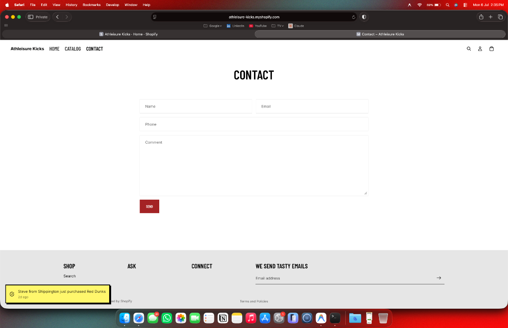
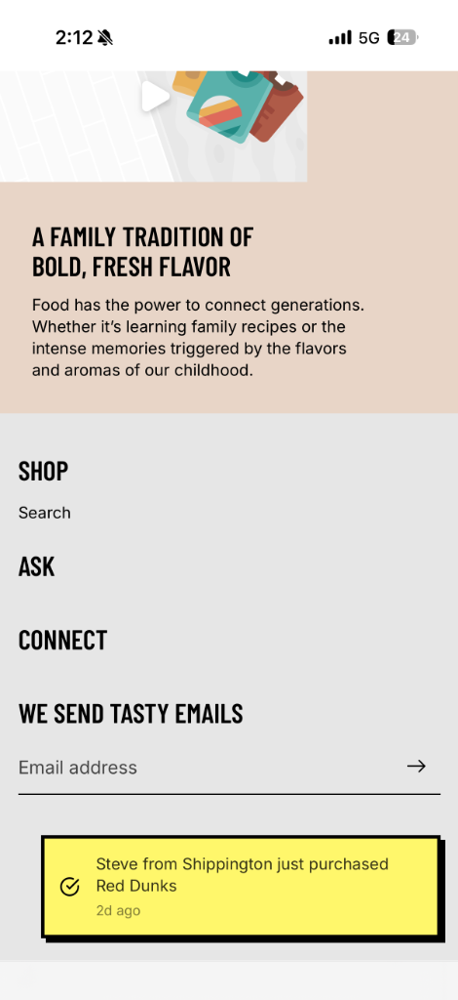

# Sotto

**Brand-native social proof for design-conscious ecommerce stores.**

[Live product](https://www.trysotto.in) · [Case study ↗](https://surya-portfolio-beige.vercel.app/work/sotto)

> **UNRESOLVED /** I built the product before I learned distribution.

**Status:** Production-ready · 20+ integrations · 2 pilot testers · Distribution not started yet

## Why I built it

I saw an intrusive social-proof popup on an otherwise beautifully designed storefront. The tactic itself made sense; the way it showed up did not. It looked obviously third-party, broke the visual language of the site, and made the experience feel cheaper.

Sotto started with a simple question: **why can't social proof feel native to the brand using it?**

The product gives merchants control over both appearance and behaviour, so the trust signal can fit the storefront instead of fighting it.

## What I built

Sotto has two main parts:

1. **Merchant dashboard** — configure appearance, behaviour, targeting and integrations.
2. **Injectable storefront widget** — a lightweight widget that runs inside external ecommerce sites.

It supports popup and inline formats, 20+ ecommerce/payment integrations, purchase-event ingestion, real active-visitor counts and an optional simulated active-visitor signal for merchants who choose to use one.

## Product decisions

### Brand-native by default

Merchants can control colour, typography, radius, animation, shadows and other visual details instead of choosing from a handful of generic notification templates.

### Behaviour matters as much as appearance

Frequency capping, URL targeting and suppression rules let merchants control when the product appears and when it should stay out of the way.

### Real and simulated activity are separate choices

Sotto supports real purchase/activity data and real active-visitor counts. It also allows a merchant to explicitly configure a simulated active-visitor signal.

### The widget has to survive someone else's website

Because Sotto runs inside external storefronts, the product has to deal with host-site CSS, browser cross-origin rules, redirects and webhook authenticity rather than assuming a controlled environment.

## Showcase

### Merchant dashboard

The control surface for configuring appearance, behaviour, targeting and integrations.


### Storefront experience

How Sotto appears inside the merchant's own storefront across desktop and mobile.




## What made it difficult

### Shadow DOM isolation

External storefront CSS can easily break an injected widget. Sotto uses Shadow DOM isolation so global rules, including aggressive `!important` styles, do not leak into the widget.

### Cross-origin and domain routing

Webhook and widget requests have to survive browser CORS rules and redirects between apex and `www` domains. That forced the implementation to treat routing details as product reliability concerns rather than deployment trivia.

### Verified webhook ingestion

Webhook secrets are isolated from ordinary account metadata, and incoming events are authenticated before being accepted.

## Current state

The product is production-ready and the integrations are usable. I currently have **two pilot testers** who run online stores, but I have not done meaningful distribution yet.

That is the part I am learning next.

## Build process

I owned the problem definition, product logic, requirements, flows, UX decisions, edge cases, testing and iteration. Implementation was AI-assisted with **Antigravity**.

## Tech stack

- Next.js
- Supabase / PostgreSQL
- CSS Modules
- Vercel
- Vanilla JavaScript widget bundle
- OpenAI for generated purchase-event copy

## Run locally

```bash
npm install
npm run build:widget
npm run dev
```

A Supabase instance and the required local environment variables are needed for the full dashboard/API flow.
